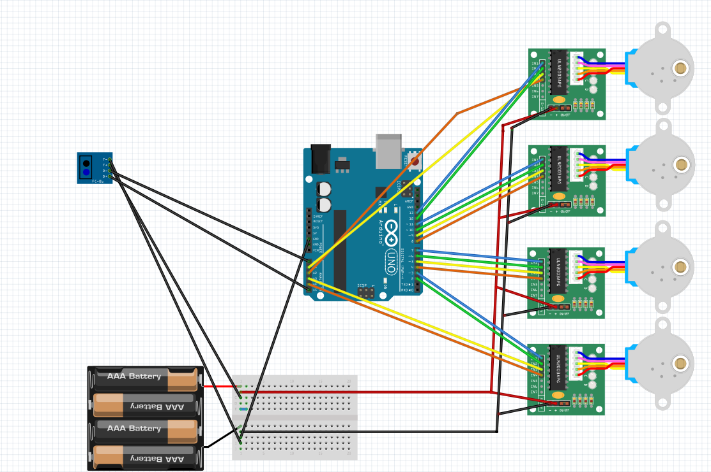
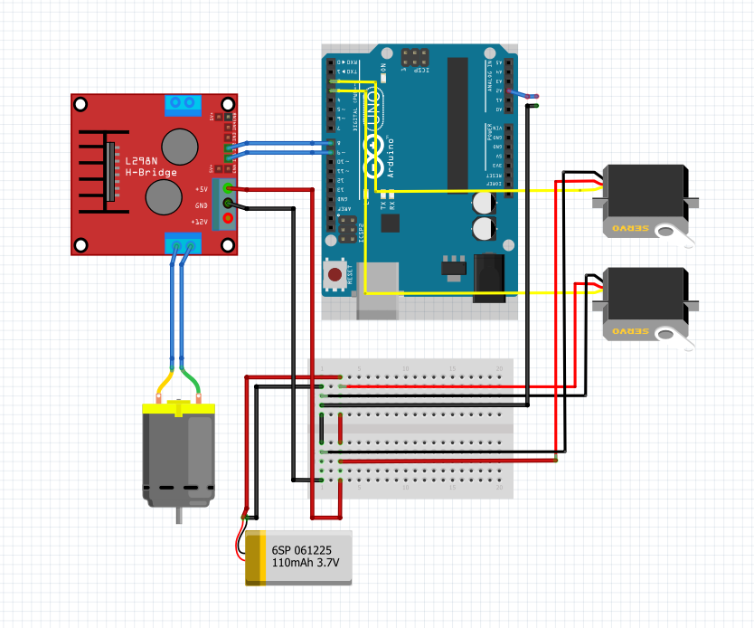

# 🎯 Mira na Cesta

Um jogo interativo que usa visão computacional com MediaPipe e OpenCV para detectar o movimento do braço e mãos do jogador, controlando uma mira motorizada conectada a um Arduino. O disparo é ativado automaticamente quando a mão direita permanece fechada por 2 segundos. A cesta se move de forma aleatória e o objetivo do usuário é fazer o máximo de pontos possível dentro de um limite de tempo escolhido pelo jogador


---

## 🗂 Estrutura do Projeto

```
├── jogo.py         # Loop principal do jogo
├── mira.py         # Processamento da câmera, detecção de pose/mão, controle do Arduino
├── interface.py    # Sistema de menus e interface gráfica lateral
├── arduino ├──  lancador.ino
            ├──  cesta.ino
```

## 🧠 Funcionalidades
- Detecção de pose com MediaPipe
- Controle da mira motorizada via Arduino com dois servos (X e Y)
- Disparo automático com gesto da mão
- Interface com menus:
  - Início
  - Dificuldade
  - Tempo de jogo
  - Resultado final com pontuação
  - HUD lateral com tempo, status, dificuldade, pontuação e posição dos servos

## 📦 Requisitos

- Biblioteca: 
  pip install opencv-python mediapipe pyserial numpy

- Arduino
Placa Arduino compatível com servos
Código que:
   - Lê mensagens no formato "X,Y" para mover os servos
   - Executa o disparo ao receber "Disparar\n"

## 🕹 Como Jogar
Execute o jogo.py:
  python jogo.py

- Selecione as opções do menu:
  - Iniciar Jogo
  - Dificuldade
  - Tempo de jogo

- Durante o jogo:
  - Mova o braço esquerdo para apontar a mira
  - Feche a mão direita por 2 segundos para disparar

A pontuação é atualizada com base na lógica de acerto que você pode implementar

## 🔧 Explicação dos Arquivos Python

- mira.py

Usa MediaPipe para rastrear:
   - Braço esquerdo → controle da mira
   - Mão direita → ativação do disparo
   - Calcula os ângulos dos servos com base na posição do punho
   - Envia comandos ao Arduino via serial:
        "X,Y" para movimentação contínua
        "Disparar\n" para disparo único

- interface.py
  Gera a interface gráfica:
    - Menus, botões, hover, tempo, dificuldade
    - Registra interações do mouse
    - Armazena as escolhas do jogador

- jogo.py
  Controla o loop principal do jogo
    - Alterna entre os estados: menu, jogo, resultado
    - Integra imagem da câmera com interface
    - Desenha o HUD lateral e atualiza informações em tempo real

## Lógica dos arduinos

1) O primeiro arduino controla a cesta com 4 motores de passos, e a cesta contém um sensor binário que detecta a luz branca e preta, como a cesta é branca e a bolinha preta o arduino consegue passar via serial para o programa em python exiber a pontuação no placar

2) O segundo arduino controla 2 servos motore para mover a base e a altura do mecanismo de disparo, que por sua vez é acionado quando o usuário fecha a mão, o python detecta e envia via serial para o arduino chamar a função de disparada

## Diagrama dos circuitos 



